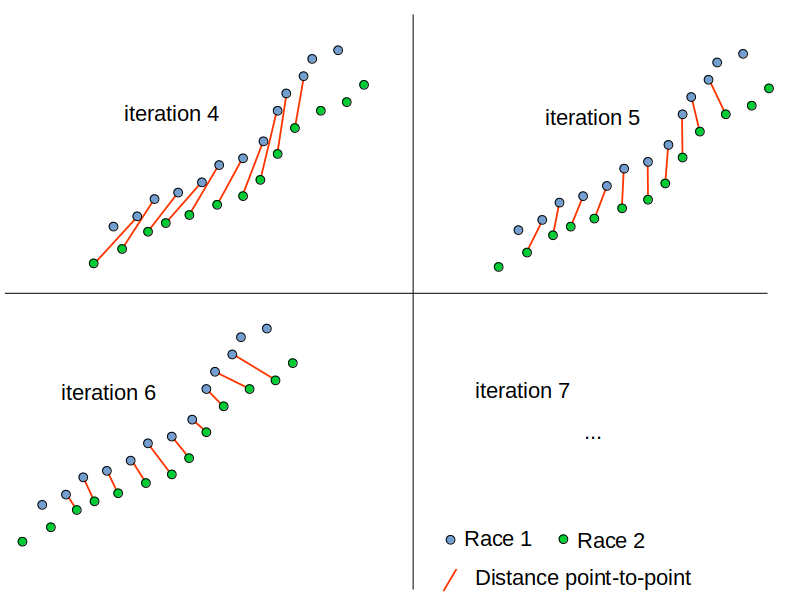
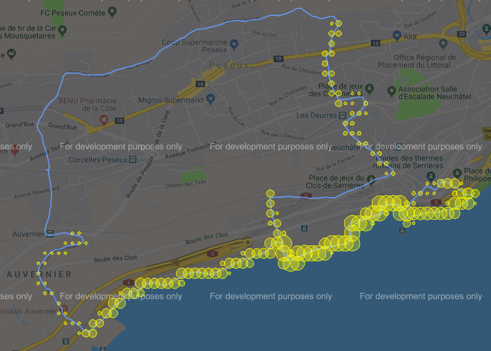

# Rapport Mini-projet 
# QSELF 2019

## HES-SO MSE 


Pedro Costa & Louis Delabays

---

## 1. Introduction

Dans le cadre du cours *Quantified Self*, il nous a été demandé de réaliser un projet en relation avec les thèmes vus durant le semestre. 

Notre projet a pour but de fournir un moyen de comparer des courses à pieds de manière un peu similaire à l'application **Strava**. Avec Strava, les segments ont été définis par un utilisateur qui a choisi un point de départ et un point d'arrivé d'une portion de sa course qu'il trouvait intéressant. Ensuite, pour chaque nouvelle course l'application détecte les portions qui correpsondent à un segment. Finalement, nous avons la possibilité de comparer nos différents efforts sur ce segment ou de se comparer avec d'autres athlètes.

Ce que nous voulons réaliser est un peu différent: Notre application trouvera d'elle même les segments intéressants sans l'intervention de l'utilisateur. Plusieurs courses à pieds seront fournies à l'application pour qu'elle trouve les portions communes des différentes courses à pieds. L'utilisateur pourra ensuite visualiser les courses et comparer les segments communs. Le descriptions complètes et détaillées du projet se trouve au chapitre suivant (*2. Description et but*).

Nous avons choisi d'utiliser des données existantes et ne pas avoir besoin d'en récolter au début du projet. Ces données sont des courses à pieds réalisé par Louis. Elles ont été enregistrées au moyen d'une montre GPS Garmin (Forerunner 645). Les détails sur l'extraction et l'exploitation de ces données sont décrites plus bas dans ce rapport (*3. Récupération des courses depuis la montre*)

Ce rapport décrit les différentes étapes effectuées depuis la récupération des données jusqu'à la visualisation/comparaison des segments.

Pour utiliser le projet il faut se référer au fichier **README.md** à la racine du projet.

## 2. Description et but

### 2.1 But du projet

Le but de ce projet est d'extraire les segments les plus interéssants à partir des courses à pied mise à disposition par un utilisateur. Dans un premier temps, toutes les courses sont confrontées à toutes les autres. Cette phase permet d'obtenir une liste de segments pour chaque course (chap. *4. Extraction des segments*). 

Avec la liste de segments d'une course, on extrait trois types de segments :

* le segment avec le plus de dénivellation positive
* le segment le plus long
* le segment avec la densité moyenne de segment la plus haute

Après avoir obtenu ces trois segments, il est possible d'effectuer  "l'inférence" d'une course. Cette étape consiste à trouver les autres courses disponibles qui passent aussi par l'un de ces trois segments. Nous avons appelé ça des *match*.

La dernière étape n'est autre que la visualition et la comparaison de la course de référence avec les courses qui ont matché un segment d'intérêts. 

### 2.2 Description

Ce point précise quelques détails de l'implémentation générale sur le projet.

* L'extraction des segments et l'inférence des courses requiert un temps de calcul passablement long (la complexité pour effectuer des comparaison *all vs all* est élevée). Pour éviter de devoir patienter pour visualiser les courses, les objets qui contiennent les données traitées sont enregistrés dans des fichiers *pickle*. Ce qui permet de les charger rapidement.

* L'ajout d'une nouvelle course parmis celle déjà à disposition nécessite de régénérer les listes de segments pour chaque course ou du moins partiellement. Ce cas d'utilisation, qui correspond à l'usage principale d'une telle application, n'est pas optimiser et n'a pas été testé durant le réalisation de ce projet.

* La génération des fichiers *html* par le package *gmplot* de Google nécessite une *API key* pour visualiser correctement les cartes. Le script Python vérifie si la variable d'environnement de cette clé est vide ou pas et construit les objets (GoogleMapPlotter) en conséquence. Si elle n'est pas présente, c'est le mode développeur qui s'affiche: Les cartes sont un peu grisée et un filigrane est appliqué.

### 2.3 Architecture logicielle

Afin de mettre en place une structure fonctionnelle et logique, nous avons décidé de crée une architecture logicielle pouvant accueillir modifications et adaptations au fil du projet.

C'est pour cela que nous avons mis en place une hiérarchie de classes qui vous est décrites ci-dessous.

#### 2.3.1 Hiérarchie des classes

Voici ci-dessous un diagramme de classe simplifié de notre architecture.


Les deux classes principales sont `Race Inferer` et `Race Manager`. Ces deux dernières vont manipuler les courses afin de les comparer entre elles, d'en tirer des statistiques, de faire de l'extraction de segments ainsi que de dessiner courses et segments sur des frames Google Map. 

Voici pour la suite une liste d'explications des autres classes :

* `Race Inferer Wrapper` : La classe `Race Inferer` étant compliquée avec beaucoup de fonctions utilitaires, nous avons décidé de créer un wrapper qui utiliserait ces fonctions afin de les regrouper en un seul endroit. De cette manière, nous récupérons très facilement les informations nécessaires à afficher sur l'application web.
* `Segment Comparator` : Permet de comparer deux segments.
* `Race Comparator`: Permet de comparer deux courses entre elles et d'en tirer les segments communs. Il contient également une fonction permettant de dessiner les deux courses comparées et les segments trouvés.
* `Segment` : Nous avons mis en place une classe segment qui contient les données des deux courses parentes ainsi que ses propres points moyennés. Elle contient également une fonction retournant les statistiques des courses parentes sur le tronçon du segment.
* `Best Segment` : Détermine quels sont les meilleurs segments de comparaison en fonction d'une course référente. On y classe ici les trois types différents de segments.
* `Race` : Classe qui va extraire les données des fichiers `.fit` faire la conversion de ces données en dataframes ainsi qu'en liste de `Point`. Une fonction retournant les statistiques de la course est également disponible.
* `Point`: Permet de sauver les diverses informations énumérée au chapitre (*4 Récupération des courses depuis la montre*) en chaque point de la course.

#### 2.3.2 Configurations

Lors de ce projet, nous avons souvent eu besoin d'avoir accès à de multiple fichiers (lecture et écriture). Nous nous sommes donc facilité la vie en ajoutant un module de `settings`. Qui permet d'accéder depuis n'importe quel fichier à n'importe quel dossier de notre projet. Ainsi, nous n'avons pas besoin de nous soucier de chemins relatifs et de tous les problèmes venant avec. Nous avons pour cela utilisé un dictionnaire pointant sur chacun des dossiers `data/*`. 

De plus, nous devions pouvoir utiliser une API Key pour Google Map, nous avons pour cela utilisé le module `python-dotenv` qui permet de mettre en place des fichiers *.env* qui nous facilite la vie avec les variables d'environnements. Nous sommes de cette manière parfaitement sécurisé et n'avons aucune clé inscrite en dur dans notre code.

Finalement, pour démarrer le serveur. Nous avons créé un petit script qui s'occupe d'effectuer les commandes nécessaires au lancement de ce dernier. L'utilisateur n'a besoin que d'exécuter ce script afin d'utiliser notre application web.

## 3. Récupération des courses depuis la montre

Les fichiers de données `.fit` sont stockés dans la mémoire interne de la montre GPS. Pour les récupérer, il faut que la montre soit configurer en *USB Mass Storage*, ainsi il suffit de la brancher à un ordinateur pour copier les fichiers `.fit` des activités effectuées. 

Avec le package Python **fitparse** et sa classe **FitFile**, nous avons pu récupérer facilement les données contenues dans les fichiers `.fit`.
Ce fichier contient un certain nombre de points enregistrés chaque seconde (dépend du mode d'enregistrement configuré dans la montre). Chaque point renferme les valeurs suivantes:

* `timestamp` :  Date et heure de la mesure
* `position_lat` : Latitude 
* `position_long` : Longitude
* `distance` : Distance parcourue depuis le début de l'activité
* `enhanced_altitude` : Altitude corrigée (à vérifier)
* `altitude` : Altitude
* `enhanced_speed` : Vitesse corrigée [m/s] (à vérifier)
* `speed` : Vitesse [m/s]
* `heart_rate` : Fréquence cardique
* `cadence` : Cadence de course [step/minute]
* `temperature` : température
* `fractional_cadence` : (?) Valeur soit 0, soit 0.5


Pour nos besoins, nous avons changé l'organisation des données des activité afin de simplifier leurs utlisations. Nous avons 2 manières de stocker les activités pour les exploiter ensuite:

* en liste d'objet `Point` (nous avons créer la classe Point)
* en Dataframe Pandas

Et finalement, une classe `Race` contient les 2 représentations de l'activité. Toutes les activités sont stockées dans une classe `RaceManager` dont les autres fonctionnalités sont détaillées par la suite. 

## 4. Extraction des segments

### 4.1 Comparaison des courses (deux à deux)

Pour trouver les portions communes entre deux courses, nous avons implémenté plusieurs classes qui permettent d'effectuer ces opérations. Dans un premier temps, nous avons cherché des librairies pour trouver les plus longues portions communes. Par exemple, l'algorithme LCSS (Longest Common Subsequence) qui est utilisé pour trouver des mots/pharses à partir de lettre ou de phonèmes. Malheureusement, les seuls implémentations trouvées pour des trajectoires en deux dimensons ne permettaient pas de faire le traitment que nous avions besoin. En effet, les coordonnées GPS des différentes courses à pieds sont toutes diffférentes. Par conséquent, il faut que nous puissions définir une *tolérance* pour laquelle nous considérons que les coordonnées sont tout de même *identiques*.

Afin d'extraire les portions communes entre deux courses, nous avons travaillé avec des fenêtres de dix points à la fois: On prend les dix premiers points de la courses de références que l'on compare avec ceux de la deuxième course. Ensuite, on fait avancer le fenêtre de dix points de la deuxième course et l'on compare à nouveau avec la course de référence. Les figures ci-dessous illustrent ce processus:


Une fois que la première fenêtre est passée devant toute la deuxième course, on l'avance de cinq points (cette valeur a été trouvée par essais; avancer de plusieurs points permet de diminuer le temps de calculs). Pour la simplicité de l'explication, la fenêtre n'est avancer que d'un point dans ces figures:



Pour définir qu'une fenêtre *matche* avec l'autre course, les dix distances points-à-points sont sommées et si elle est inférieur à un seuil, alors on stocke le fenêtre de dix points. Pour extraire les segments, on sépare les parties continues et discontinues: 


*Les deux courses sont en vert et en bleu. La trajectoire commune est en rouge*

Pour ce faire, on parcourt les points de la trajectoire commune et on contrôle s'ils proviennent d'indices successifs de la première course. Lorsqu'ils ne sont pas successifs, on *split* en deux parties et ainsi de suite. On obtient une liste de portions communes aux deux courses. Pour améliorer les étapes suivantes, les trajectoires communes sont moyennées:


*Les deux courses sont en vert et en bleu. La trajectoire commune moyennée est en rouge*

Finalement, les portions communes sont transformées en objet `Segment` qui contient les points des courses sources et la trajectoire moyennées. Cette objet permet également de retrouver les deux courses qui ont permis de trouver ce segment.


### 4.2 Au niveau de l'application

La procédure décrite au *point 4.1* est effectuée dans l'application pour chaque course contre toutes les autres courses. Ainsi, dans l'objet `RaceManager`, il y a un dictionnaire avec une clé par course qui contient une liste de tous les segments trouvées pour cette clé. Cette liste de segments en contient souvent plusieurs dizaines et ils sont pour la plupart très similaire. L'étape de traitement suivante extrait, parmis les segments de la liste, les plus pertinents selon plusieurs critères.

## 5. Recherche des segments pertinents

Etant donné le nombre trop important de segments trouvés pour chaque course (chapitre précédent), nous avons décidé de nous focaliser sur trois types de segments, à savoir le segment le plus long, celui avec le plus de dévivelation positive et celui avec la densité moyenne la plus élevée.

Pour extraire les segments les plus pertinents pour chaque type, nous avons implémenté la classe `BestSegment`. Ensuite, les meilleures segments de chaque type sont stockés dans le `RaceManager`.

### 5.1 Segment avec le plus de dénivellation

Pour extraire ce type de segment parmis la liste de segments d'une course, il faut effectuer un peu de traitement sur les données d'altitude. Tout d'abord, on applique la dérivé (discrète) sur les altitudes de la course (`np.diff(...)`). Etant donné que l'on cherche la dénivellation positive (la montée, pas la descente), on met toutes les valeurs négatives de la dérivée à zéro. Et finalement, on somme toutes les valeurs (`np.sum(...)`). Ainsi, on obtient le dénivelé positif du segment.

On cherche le segment avec le dénivelé positif le plus important.


### 5.2 Segment le plus long

Ce segment est le plus simple à trouver parmis les trois types de segment à extraire. On cherche le segment dont la différence entre la `distance` de fin et celle du début est la plus grande. En effet on ne peut pas se baser sur le nombre de points enregistrés par la montre, car celle-ci effectue une mesure environ chaque seconde et pas en fonction de la distance.

### 5.3 Segment avec le plus de densité moyenne

Ce dernier type de segment est celui qui nécessite le plus d'opérations et de temps à l'extraction. Mais c'est aussi un segment très intéressant car, normalement, un nombre plus important de courses vont matcher avec lui. Donc, cela permet de le comparer avec un plus grand nombre d'efforts différents du même utiliateurs.

La première étape consiste à créer une *density map* pour chaque course à partir de tous les segments trouvés au chapitre 4. Pour cela, on subdivise toute la surface rectangulaire que prennent les segments en petites zones rectangulaires.

En parcourant ces zones, on compte le nombre de segment différents compris dans chaque zone. On obtient une carte de densité des segments pour une course données. Voici le résultat pour une course (ici seules les densités supérieures à 2 sont affichées):



*La trajectoire de la course est en bleu et la densité de chaques zones est représentée par le diamètre des cercles jaunes*

Pour chaque segment, on extrait diverses valeurs, comme par exemple:

* la densité **minimum** 
* la densité **maximale**
* la densité **moyenne**

Après plusieurs essais, il a été constaté que la densité moyenne d'un segment est la mesure la plus utile pour trouver le segment par lequel passe le plus grand nombre de courses différentes. 

Illustration du segment avec la plus grand densité moyenne pour une course :


*Le segment avec la plus grande densité moyenne est en rouge*


## 6. Recherche des courses avec segments communs

Grâce à l'étape précédente (chapitre 5), nous disposons du meilleure segment de chaque type pour les différentes courses. Dans cette dernière étape de traitement, il s'agit d'effectuer l'*inférence* des courses selon leurs meilleures segments. Cela consiste à :

1. Choisir une course à *inférer*
2. A partir des segments pertinents, trouver les courses qui matches ces segments
3. Stocker les matches pour pouvoir les comparer / visualiser par la suite

**Remarque:** Les segments ont initialement été trouvés en cherchant les portions communes de deux courses. Mais lors de l'*inférence*, il est fréquent de trouver d'autres courses que celles d'origines qui matchent également un segment. Typiquement, le segment avec la meilleure densité moyenne permet de comparer un nombre plus importants d'efforts différents.

Cette étape d'*inférence* prend un temps relativement important. C'est pourquoi, la classe `RaceInferer` permet de stocker les données après le traitement / inférence. Ainsi, notre outil de visualisation peut simplement reprendre les données préprocessées pour les afficher selon la volonté de l'utilisateur.

## 7. Visualisation des courses & segments

Maintenant que nous avons fait une extraction correcte de toutes les courses et des segments de comparaisons correspondants. Il nous faut mettre en place un moyen de les visualiser. Vu que nous avons réalisé l'entièreté de notre code en python, la solution la plus logique pour rapidement mettre en place une application web se trouve être le microframework Flask.

Notre application de visualisation est fonctionnelles sur Safari, Chrome et Firefox.

### Backend Flask (API)

Flask est un miroframework web très simpliste permettant de rapidement mettre en place une gestion de chemins URL et de requêtes POST et GET. C'est exactement ce que nous recherchions dans ce projet. Nous ne voulions pas nous encombrer d'une mise en place lourde et compliquée d'un framework tel que Django ou autres.

Flaks permet de faire des rendus de templates html dynamique à l'aide de [Jinja2](http://jinja.pocoo.org/docs/2.10/).

Mais il permet également de créer une API et c'est principalement cette compétence que nous allons exploiter. 

Voici comment nous avons procédé pour créer notre service web :

* Créer une fonction accueillant une requête **POST** ou **GET** (ou les deux mais déconseillé) à l'aide des décorateurs Flask.
* Dans le décorateur, indiqué à quel url cette fonction sera accessible.
* Traiter les données potentiellement reçues.
* Créer/Modifier les données que nous souhaitons envoyer.
* Formater ces dernières sous la forme d'un dictionnaire.
* Renvoyer le dictionnaire à l'aide de la fonction `jsonify(json_dict)`.

Voici un exemple : 

```python
@app.route('/race-detail/visualisation', methods=['POST'])
def post_visualisation():
    race_name = request.form['race_name']
    output_folder = st.files["output_folder"]
    filename = os.path.join(output_folder, f"{race_name}.html")

    if filename not in glob.glob(f'{output_folder}/*.html'):
        RACE_MANAGER.races[race_name].draw()

    json_dict = {'filename': f"/static/output/{race_name}.html"}

    return jsonify(json_dict)
```

Nous définissons un décorateur contenant l'url sur lequel sera disponible cette fonction, la méthode http utilisée. Puis nous traitons les données d'entrée en récupérant le nom de la course dans le formulaire de la requête **POST**.

Nous appliquons les modifications ou acquisitions nécessaire des données que la fonction va renvoyer, ici le lien du fichier html affichant la course sur Google Map. Puis nous envoyons ce liens via un dictionnaire qui sera formaté en json grâce à la fameuse fonction `jsonify()` de Flask.

Nous avons procédé de la même manière pour toutes les autres fonctions. 

Ainsi, nous avons créé une API qui rend accessibles les informations suivantes :

* Le lien du Google Map pour une course donnée (`/race-detail/visualisation`)
* Les statistiques pour une course données (`/race-detail/statistics`)
* Les segments obtenus entre deux courses (`/race-detail/comparison_segments`)
* Le lien du Google Map pour la comparaison de deux courses (`/race-detail/comparison_visualisation`)
* Les statistiques pour un segment donné (`/race-detail/comparison_table`)
* Les coordonnées de début et de fin du segment afin de traiter les graphes lors de la comparaison (`/race-detail/comparison_graphs`)

À noter que ces liens ne sont accessibles que par requête **POST**, si quelqu'un souhaitait accéder à ces liens depuis l'extérieur, il lui serait nécessaire de passer en argument un formulaire avec les bonnes entrées pour recevoir les données correspondantes.

### Front-End

Concernant la partie client, nous avons décidé d'aller au plus simple en utilisant du Java Script (principalement du JQuery). 

Nous mettons à jour l'affichage de nos pages grâce à des appels asynchrones à notre API et créons le contenu correspondant grâce aux données récupérées de façon dynamique.

Nous avons cinq pages parmi lesquelles l'utilisateur peut naviguer principalement à l'aide d'onglets.


#### La page d'accueil

Lorsque l'utilisateur pointe sur l'adresse principale du serveur, il arrive sur notre page d'accueil simpliste.


Il est possible ici de choisir la course de référence que nous souhaitons analyser.

#### L'onglet des statistiques

En pressant sur le bouton submit après avoir choisi une course de référence, vous arrivez sur la page des statistiques de cette dernière.


On peut y apercevoir les graphes générés à l'aide de Chart Js qui sera décrit dans le chapitre suivant.

#### L'onglet de comparaison

Dans l'onglet de comparaison, nous avons un rappel des statistiques de la course sur la gauche, et sur la droite une liste des meilleurs segments trouvés après comparaison avec les autres courses. 


Après avoir choisi le segment souhaité, et pressé le bouton *compare*, vous verrez que la page va se mettre à jour et afficher dans le tableau de gauche les statistiques des deux courses sur le segment choisi. Ainsi que sur la droite un Google Map affichant les deux courses en *bleu* la course de référence, en *vert* la course comparée et en *rouge* le segment. 

Un bouton afin de retourner à la page `compare` ainsi qu'un bouton permettant d'accéder à la page de la course comparée apparaissent également.


De plus, les graphes des vitesses, bmps et dénivelés sont mis à jour afin de mettre en évidence le tronçon de la course ou le segment intervient.


#### L'onglet de visualisation

Finalement, un onglet est entièrement consacré à la visualisation de la course sur une frame Google Map.


### Chart Js

[ChartJs](https://www.chartjs.org/) est une bibliothèque permettant de dessiner toutes sortes de graphes sur des canvas html. Ainsi, nous utilisons les données récupérées des courses pour les transmettre aux fonctions de `Chart Js` qui s'occupera de mettre en page les graphes. 

La configuration de cet outil ne fut pas des plus simples, il a fallu donc légèrement bricoler pour obtenir les résultats finaux. Cependant, une fois pris en main, nous avons pu créer des résultats sympathiques tel que la mise en évidence des segments par rapport aux données de la course.

### Google Map

[GMPlot](https://pypi.org/project/gmplot/) est un paquet python permettant de dessiner par-dessus une map de chez Google. Une fois le dessin souhaité fini, `gmplot` nous permet d'exporter le résultat sous format html. Ce qui est très pratique car il nous suffit en suite d'importer ces derniers en tant que frames dans notre outil de visualisation.

## 8. Conclusion

A ce stade, le projet permet de comparer les différentes courses à pieds effectuées par un utilisateur. Et plus particulièrement de comparer les parties de courses communes à plusieurs activités. L'application trouve et sélectionne les segments les plus pertinents pour une course choisie et, au moyen d'un navigateur Web, de visualiser les segments. 

L'application se sépare en deux parties distinctes : La partie de recherche de segments et l'outil graphique pour visualiser les courses et les segments. Cela permet d'améliorer et d'ajouter des fonctionnalités à l'une ou l'autre des parties sans être forcé de faire de même sur l'autre. Dès lors, il serait relativement simple d'augmenter le nombre de type de segments automatiquement extrait des courses pour offrir de plus amples possibilités de comparaisons.

L'extraction des segments requiert un temps relativement long. Ce qui nécessite d'effectuer les étapes de traitement sur les courses et les segments avant d'utiliser l'outil de visualisation. Actuellement, il n'est pas possible d'ajouter une nouvelle course et de pouvoir directement la comparer aux autres. 

## 9. Perspectives d'améliorations

Voici quelques perspectives d'améliorations possibles pour compléter ce projet :

* Ajouter d'autres types de segment intéressant basé sur d'autres critères
* Au lieu de prendre le meilleur segment pour chaque type (longueur, dénivellation, densité), prendre les 3 meilleurs de chaque type
* Sélectionner les meilleurs segments à partir de plusieurs critères en les combinant
* Permettre d'ajouter une nouvelle course sans avoir à régénérer les données pour toutes les courses (seulement pour celle qui a été ajoutée)
* Accélérer les phases d'extraction et d'inférence en améliorant le code et en utilisant du *multithreading*

## 10. Bibliographie

---